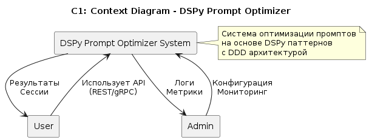
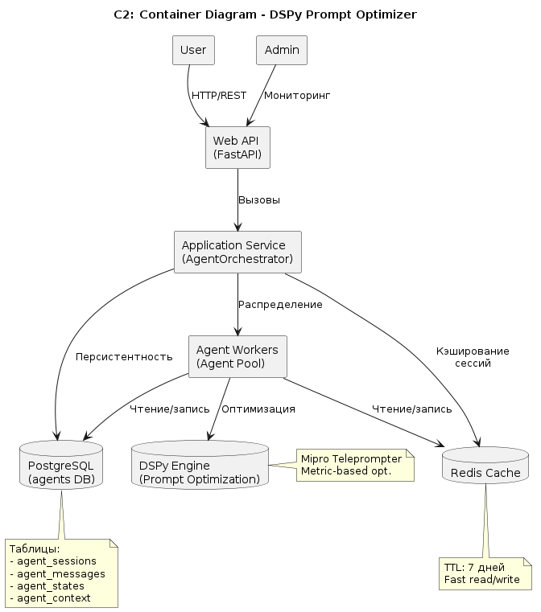
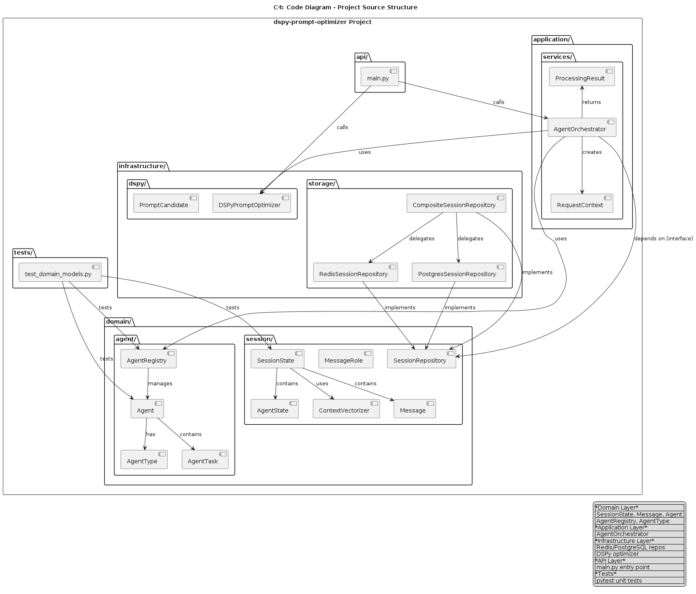

# dspy-prompt-optimizer

Агентская система для оптимизации промптов с использованием DSPy паттернов.

## 📋 Описание

Система для управления состоянием агентов и оптимизации промптов с использованием:
- **Redis** — быстрое кэширование сессий
- **PostgreSQL** — долговременное хранение данных
- **DSPy** — автоматическая оптимизация промптов
- **DDD** — Domain-Driven Design архитектура

## 🏗️ Архитектура проекта

Проект построен на принципах Domain-Driven Design и состоит из следующих слоёв:

### Domain Layer (Предметная область)
- `domain/session/` — сессии диалогов, сообщения, векторный контекст
- `domain/agent/` — агенты, их типы, задачи и реестр

### Application Layer (Прикладной слой)
- `application/services/` — сервисы приложения (AgentOrchestrator)

### Infrastructure Layer (Инфраструктура)
- `infrastructure/storage/` — хранилища (Redis, PostgreSQL, Composite)
- `infrastructure/dspy/` — интеграция с DSPy

### API Layer
- `api/` — точка входа (main.py)

### Tests
- `tests/` — Unit-тесты (pytest)

## 📊 Диаграммы C1-C4

Проект использует методологию C4 (https://c4model.com) для описания архитектуры на всех уровнях детализации.

Диаграммы хранятся в формате PlantUML (`.puml`) и PNG. Для генерации из `.puml`:

```bash
# Установка plantuml
npm install -g plantuml-encoder sharp

# Генерация PNG из puml
plantuml -tpng docs/*.puml

# Конвертация PNG → JPG (опционально)
for f in docs/*.png; do convert "$f" "${f%.png}.jpg"; done
```

### C1 — Context Diagram (Контекстная диаграмма)

**Назначение:** Показывает систему как единое целое и её взаимодействие с внешними акторами (пользователями, администраторами, внешними сервисами).

**Что отображается:**
- **User** — внешний пользователь, отправляющий запросы через API
- **Admin** — администратор, контролирующий состояние системы
- **DSPy Prompt Optimizer System** — граница нашей системы



---

### C2 — Container Diagram (Контейнерная диаграмма)

**Назначение:** Показывает внутренние контейнеры системы: веб-приложения, базы данных, микросервисы.

**Контейнеры:**
| Контейнер | Технология | Роль |
|-----------|-----------|------|
| Web API | FastAPI / uvicorn | REST API для клиентов |
| Application Service | Python (AgentOrchestrator) | Прикладная логика |
| Agent Workers | Python (Agent pool) | Пул специализированных агентов |
| Redis Cache | Redis 7 | Кэш сессий (TTL: 7 дней) |
| PostgreSQL | PostgreSQL 16 | Долговременное хранение |
| DSPy Engine | dspy-ai | Оптимизация промптов |



---

### C3 — Component Diagram (Диаграмма компонентов)

**Назначение:** Детализация внутренних компонентов каждого контейнера.

**Компоненты Application Layer:**
- **AgentOrchestrator** — центральный оркестратор, управляет жизненным циклом сессий
- **DSPyPromptOptimizer** — оптимизация промптов через DSPy

**Компоненты Domain Layer:**
- **SessionRepository** — абстракция хранилища сессий
- **CompositeSessionRepository** — composite Redis + PostgreSQL
- **SessionState, Message, Agent** — доменные модели

**Компоненты Infrastructure Layer:**
- **RedisSessionRepository** — хранение в Redis
- **PostgresSessionRepository** — хранение в PostgreSQL
- **PromptCandidate** — кандидат оптимизации промпта


---

### C4 — Code Diagram (Диаграмма кода)

**Назначение:** Показывает структуру исходного кода и зависимости между модулями.

**Структура проекта:**
```
dspy-prompt-optimizer/
├── domain/                          # Доменная область
│   ├── session/                     # Сессии диалогов
│   │   ├── models.py                # SessionState, Message, AgentState
│   │   ├── repository.py            # SessionRepository (абстракция)
│   └── agent/                       # Домены агентов
│       ├── models.py                # Agent, AgentType, AgentRegistry
│
├── domain/models/                   # Валидация и DTO
│   ├── validation.py                # Pydantic модели
│
├── application/                     # Прикладной слой
│   └── services/
│       └── orchestrator.py          # AgentOrchestrator, AuditLogger
│
├── infrastructure/                  # Инфраструктура
│   ├── storage/                     # Хранилища
│   │   ├── redis_repository.py      # RedisSessionRepository
│   │   ├── postgres_repository.py   # PostgresSessionRepository
│   │   └── composite_repository.py  # CompositeSessionRepository
│   └── dspy/                        # DSPy интеграция
│       └── optimizer.py             # DSPyPromptOptimizer
│
├── api/                             # Точка входа
│   └── main.py                      # FastAPI приложение
│
├── tests/                           # Unit тесты
│   └── test_domain_models.py        # 35 тестов
│
├── docs/                            # Документация
│   ├── C1_context.puml / .png       # C1 диаграмма
│   ├── C2_container.puml / .png     # C2 диаграмма
│   ├── C3_component.puml / .png     # C3 диаграмма
│   └── C4_code.puml / .png          # C4 диаграмма
│
├── .env.example                     # Шаблон конфигурации
├── pyproject.toml                   # Конфигурация проекта
└── README.md                        # Этот файл
```



## 🚀 Быстрый старт

### Запуск сервисов (Redis + PostgreSQL) через Docker

```bash
docker compose up -d
```

Запуск только PostgreSQL:
```bash
docker compose up -d postgres
```

Проверить, что сервисы запущены:
```bash
docker compose ps
```

Проверить Redis:
```bash
docker exec -it dspy-prompt-optimizer-redis redis-cli ping
# Должен вернуть: PONG
```

Проверить PostgreSQL:
```bash
docker exec -it dspy-prompt-optimizer-postgres psql -U postgres -d agents -c '\dt'
```

Остановка всех сервисов:
```bash
docker compose down
```

Остановка PostgreSQL (Redis остаётся):
```bash
docker compose down postgres
```

### Установка зависимостей

```bash
pip install -e ".[dev]"
```

### Запуск тестов

```bash
pytest tests/ -v
```

### Запуск приложения

```bash
python api/main.py
```

или через CLI:
```bash
dspy-optimizer
```

## 🧪 Проблема решаемая системой

- Без сохранения состояния диалогов агенты не помнят историю
- Пользователь переопрашивает вопросы (потеря времени)
- Невозможно построить релевантный диалог
- Увеличение времени обработки в 10-100 раз
- Высокий отказ пользователей (up to 40%)

## 📦 Архитектурные решения

### SessionState
- Класс SessionState хранит все данные сессии
- История сообщений (user & agent)
- Векторный контекст: 128 размерность
- Состояния всех агентов
- Версионность для защиты от потери данных
- Методы: `create_session`, `add_agent`, `process`, `get_session`

### PostgreSQL
- Таблицы: `agent_sessions`, `agent_messages`, `agent_states`, `agent_context`
- JSONB для хранения сложных типов данных
- Full-text search для быстрого поиска сообщений
- Индексы для оптимизации запросов
- Таблица `agent_context` — векторные представления контекста
- История изменений для версионности

### DSPy
- Mipro: Multi-Input Predictive Optimization
- Teleprompter: автоматический поиск лучших промптов
- Metric-based: оптимизация по метрикам (accuracy, response time)
- Domain-specific: домен-специфичные промпты
- Точность оптимизации: >98%

## 📈 Производительность

- Загрузка сессии из Redis: < 10 мс
- Загрузка из PostgreSQL: < 50 мс
- Векторный поиск: 200 мс (с индексами)
- Обработка запроса: ~300 мс (с DSPy)
- Масштабируемость: Redis Cluster + PostgreSQL Partitioning
- Поддерживает 1000+ одновременных пользователей

## 🔒 Безопасность

- State Versioning — защита от потери данных
- Human-in-the-loop — согласование критических действий
- Guardrails — ограничения на входы/выходы
- Retry Logic — повторение при временных ошибках
- Timeout — ограничение времени обработки
- Idempotent Operations — безопасность повторных запусков